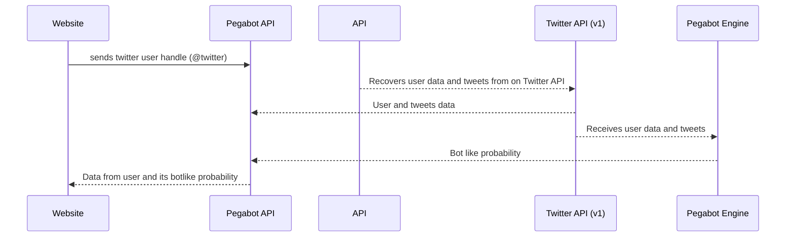

# Repository for the Pegabot API  
  

## Pegabot ecosystem



## How to install
  
This code run with `python 3.9.4`. The packages are listed at the `requirements.txt` file.  
   
  
## install the virtualenv package on your python via pip  
  
at the terminal just run:  
  
`python -m pip install --user virtualenv`  
  
## create a virtual environment   
  
At the terminal type, inside the project folder type:  
  
`virtualenv venv`   

and you should see a `env/` dir inside your project folder or with the given name you choose at the step before.  
  
  
## step 1: give permission to `init.sh` file to run  
  
```console
chmod +x .init.sh
```
  
## step 2: create your .env file locally  
  
on terminal, inside the project folder just copy and rename the `.env-example` to `.env`  
  
`$ cp .env.example .env`  
  
#### generate an updated version of your `virtualenv` to a requirements.txt file  everytime you update a package in this project
  
Go to your terminal and type  
  
`pip freeze > requirements.txt`  
  
After that, you should commit only your `requirements.txt` file instead your virtualenv `/venv` directory (which is ignored by default on this project on .gitignore file) 

 ## step 3: set up your `.env` variables:

```console
twitter_api_key=""

twitter_api_secret=""

twitter_access_token=""

twitter_access_token_secret=""

DB_USER=

DB_HOST=

DB_PASSWORD=

DB_PORT=

DATABASE_URL=
```

## running the project 

The script `init.sh` contains the commands necessary for your to install your `requirements.txt`file and run the project.

At your terminal 
```console
./init.sh
```